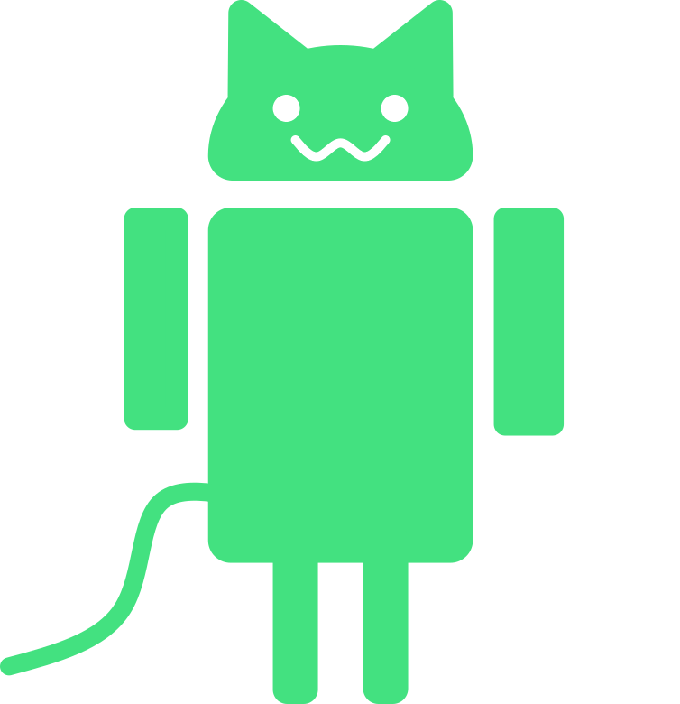
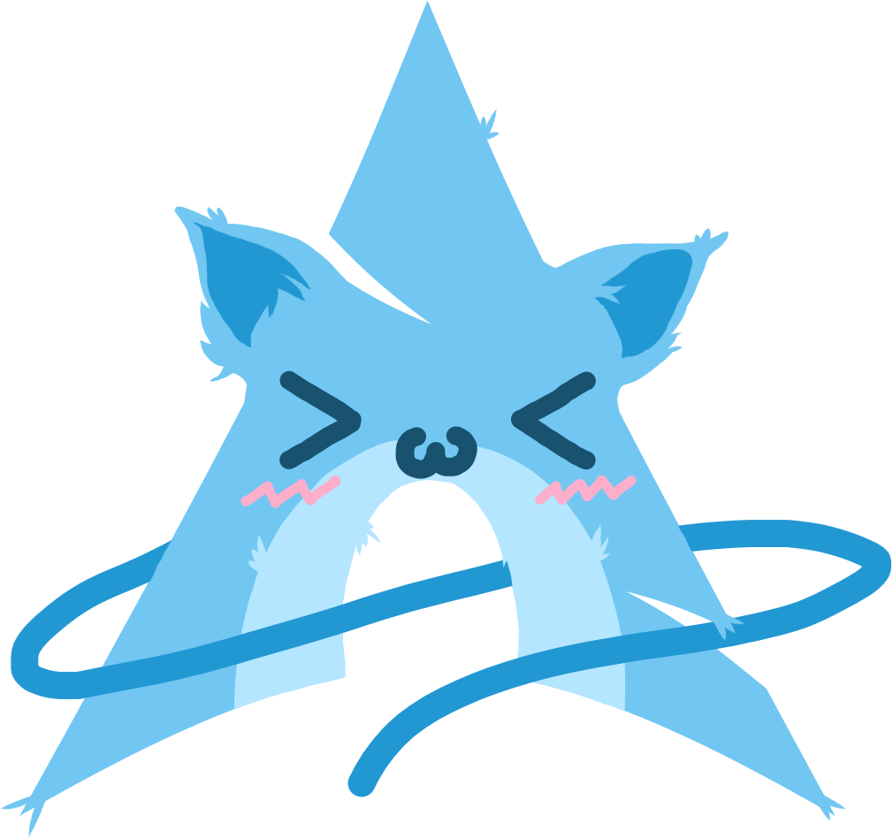
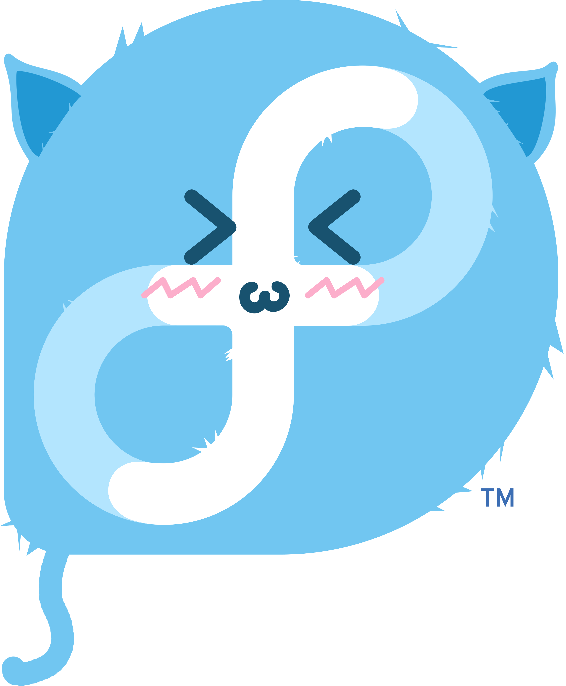
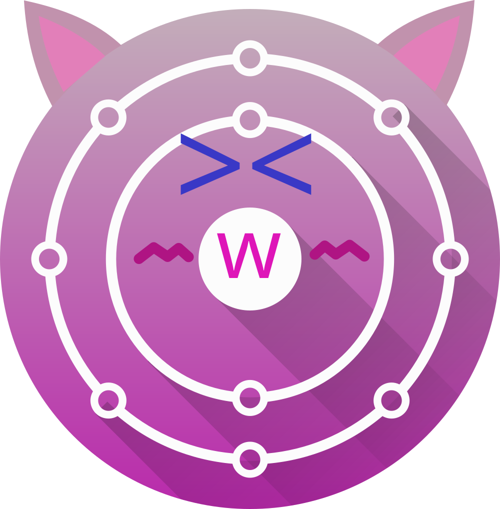
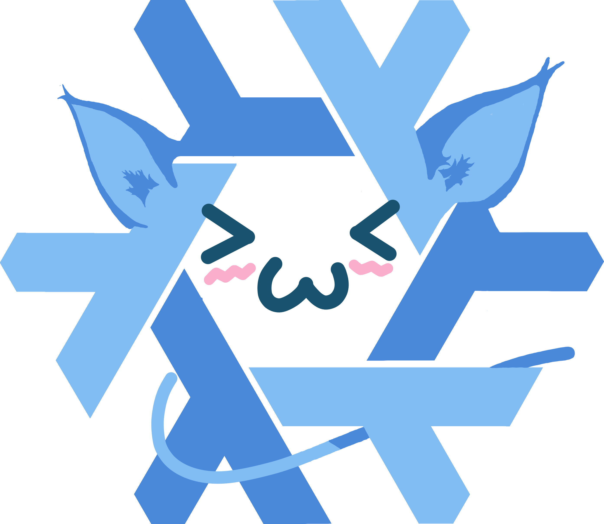
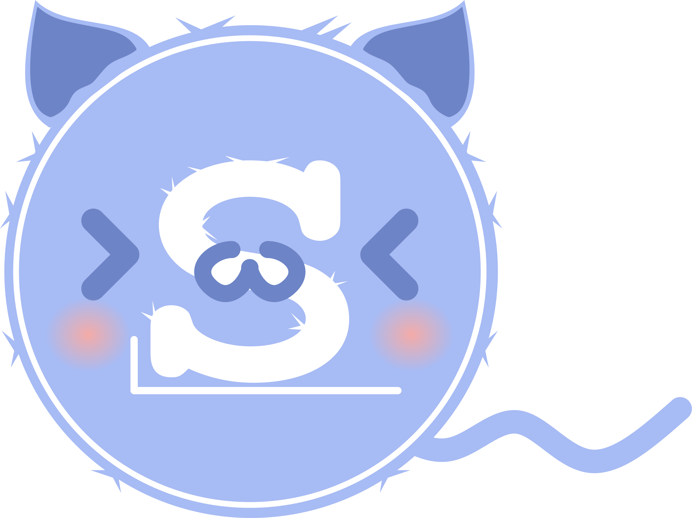
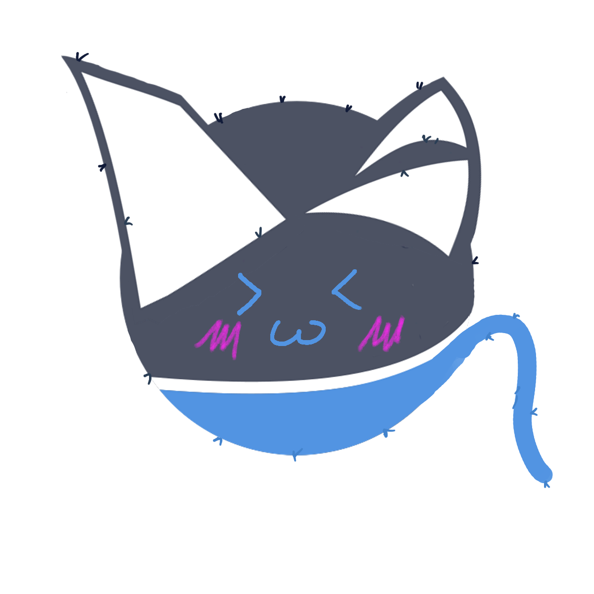
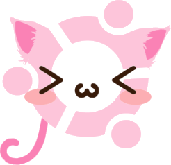
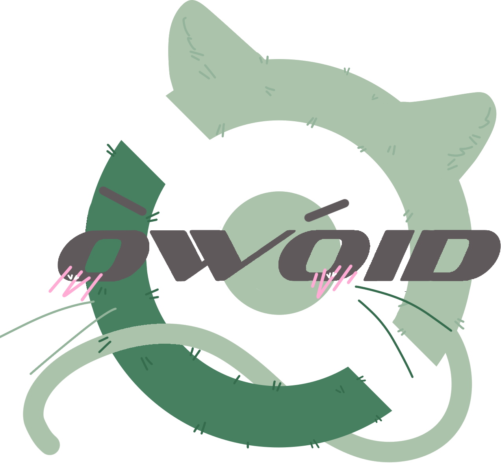

# TODO: Complete the table
---
# Supported Operating Systems

|System Codename|System Custom Name|Image Logo|Ascii Logo|
|---------------|------------------|----------|----------|
|alpine|Nyalpine|n/a|[res/ascii/alpine.txt](./res/ascii/alpine.txt)|
|amogos|AmogOwOS||[res/ascii/amogos.txt](./res/ascii/amogos.txt)|
|android|Nyandroid||[res/ascii/android.txt](./res/ascii/android.txt)|
|arch|Nyarch LinUwU||[res/ascii/arch.txt](./res/ascii/arch.txt)|
|arcolinux|ArcOwO LinUwU||[res/ascii/arcolinux.txt](./res/ascii/arcolinux.txt)|
|artix|Nyartix LinUwU||[res/ascii/artix.txt](./res/ascii/artix.txt)|
|debian|Debinyan|n/a|[res/ascii/debian.txt](./res/ascii/debian.txt)|
|deepin|Dewepyn|n/a|[res/ascii/deepin.txt](./res/ascii/deepin.txt)|
|devuan|Devunyan||[res/ascii/devuan.txt](./res/ascii/devuan.txt)|
|endeavouros|EndeavOwOs||[res/ascii/endeavouros.txt](./res/ascii/endeavouros.txt)|
|fedora|Fedowa||[res/ascii/fedora.txt](./res/ascii/fedora.txt)|
|femboyos|FomboyOwOs|n/a|[res/ascii/femboyos.txt](./res/ascii/femboyos.txt)|
|freebsd|FweeBSD|n/a|[res/ascii/freebsd.txt](./res/ascii/freebsd.txt)|
|gentoo|GentOwO||[res/ascii/gentoo.txt](./res/ascii/gentoo.txt)|
|gnu|GnUwU|n/a|[res/ascii/gnu.txt](./res/ascii/gnu.txt)|
|guix|GnUwU GUwUix||[res/ascii/guix.txt](./res/ascii/guix.txt)|
|ios|iOwOS|n/a|[res/ascii/ios.txt](./res/ascii/ios.txt)|
|linuxmint|LinUwU Miwint||[res/ascii/linuxmint.txt](./res/ascii/linuxmint.txt)|
|macos|MacOwOs|n/a|[res/ascii/macos.txt](./res/ascii/macos.txt)|
|manjaro-arm|Myanjawo AWM||[res/ascii/manjaro-arm.txt](./res/ascii/manjaro-arm.txt)|
|manjaro|Myanjawo||[res/ascii/manjaro.txt](./res/ascii/manjaro.txt)|
|neon|KDW NeOwOn||n/a|
|nixos|NixOwOs||n/a|
|openbsd|OwOpenBSD||[res/ascii/openbsd.txt](./res/ascii/openbsd.txt)|
|opensuse-leap|OwOpenSUSE Leap||[res/ascii/opensuse-leap.txt](./res/ascii/opensuse-leap.txt)|
|opensuse-tumbleweed|OwOpenSUSE Tumbleweed|n/a|[res/ascii/opensuse-tumbleweed.txt](./res/ascii/opensuse-tumbleweed.txt)|
|pop|PopOwOs||[res/ascii/pop.txt](./res/ascii/pop.txt)|
|raspbian|RaspNyan|n/a|[res/ascii/raspbian.txt](./res/ascii/raspbian.txt)|
|rocky|Wocky LinUwU|n/a|[res/ascii/rocky.txt](./res/ascii/rocky.txt)|
|slackware|Swackwawe||[res/ascii/slackware.txt](./res/ascii/slackware.txt)|
|solus|SOwOlus||[res/ascii/solus.txt](./res/ascii/solus.txt)|
|ubuntu|UwUntu||[res/ascii/ubuntu.txt](./res/ascii/ubuntu.txt)|
|unknown|||[res/ascii/unknown.txt](./res/ascii/unknown.txt)|
|void|OwOid||[res/ascii/void.txt](./res/ascii/void.txt)|
|windows|WindOwOws|n/a|[res/ascii/windows.txt](./res/ascii/windows.txt)|
|xerolinux|xUwULinUwU|n/a|[res/ascii/xerolinux.txt](./res/ascii/xerolinux.txt)|
